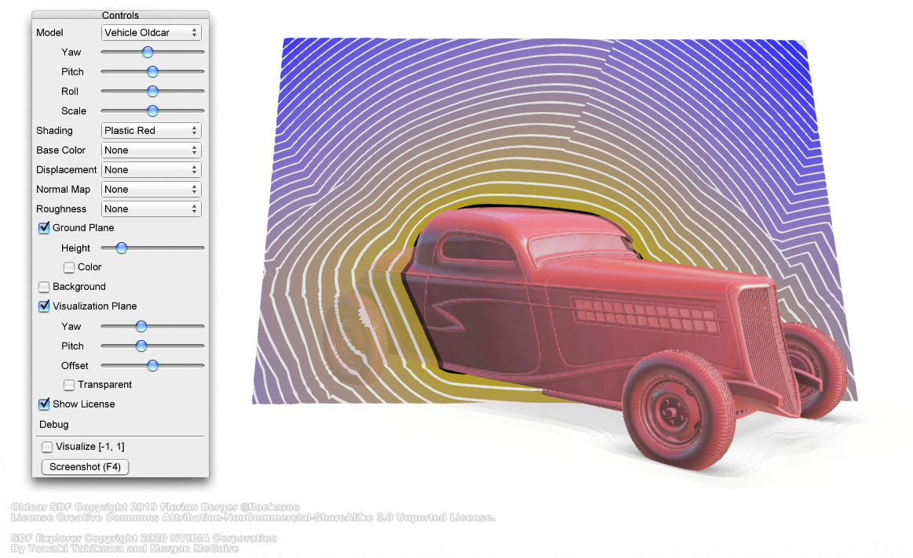

## A Dataset and Explorer for 3D Signed Distance Functions

This is the official code repository for our JCGT paper on a new SDF dataset:

[A Dataset and Explorer for 3D Signed Distance Functions (JCGT/I3D 2022)](https://tovacinni.github.io/sdf-explorer)

[Towaki Takikawa](https://tovacinni.github.io), [Andrew Glassner](https://www.glassner.com), 
[Morgan McGuire](https://casual-effects.com)



In this work we provide a dataset and an explorer to visualize, analyze and work with signed distance functions (SDFs). We currently have 63 SDFs, and hopefully more in the future!

If you have any feature requests, feel free to submit an issue!

## Downloading the Dataset

Our dataset is available as `.npz` files for download [here](https://drive.google.com/file/d/1StTkilQSk83lj60VaqcMHh3GT73CSIKT/view?usp=sharing) 
(4.3 GB). The dataset contains randomly
sampled point clouds along with their signed distances and gradients.

To load the `.npz` files, you can simply do:

```python
import numpy as np
npz_file = np.load("Snail.npz")
position = npz_file['position']
distance = npz_file['distance']
gradient = npz_file['gradient']
```

## Build Instructions for the Interactive Explorer

### G3D Innovation Engine

Our explorer depends on the [G3D Innovation Engine](https://casual-effects.com/g3d/). 

Refer to [the G3D build guide](https://casual-effects.com/g3d/G3D10/readme.md.html?) to install G3D for the appropriate OS.

### Downloading Matcaps

For the code to properly run, you will need to download a few matcap files. To download matcaps:

```
pip install wget
python download_matcaps.py
```

Alternatively, if you have your own matcaps or download matcaps yourself from the internet, you can 
place them in `data-files/matcap/categoryname/yourmatcap.png`.

### Linux Instructions

To build and run for Linux, simply run:

```
icompile --opt --run
```

To run the sampling mechanism, run:

```
icompile --run --sample <Pattern> <N> <SDF> <outfile>
```

Where the argument to `<Pattern>` is the name of the sampler shader,
`<N>` is the number of points to sample, `<SDF>` is the name of the SDF shader,
and `<outfile>` is the file path to save the point samples to.

### Loading the Binaries

If you want to load the custom generated binary files from the sampler, you can use the Python 
package in `sdfdes` (see the README inside the `sdfdes` folder for more details).

## Extending the Dataset

Extending our dataset mostly amounts to adding files into appropriate subdirectories in `data-files`.
We welcome any pull requests to add any shaders, sampling schemes, or matcaps, but please 
be respectful and adhere to GitHub's 
[community guidelines](https://docs.github.com/en/free-pro-team@latest/github/site-policy/github-community-guidelines).

### Signed Distance Functions

To add a new SDF shader, simply add a new GLSL file under `data-files/sdf`. The GLSL function 
will need to implement a single function which takes in a `vec3` as input and spits out a `float`. 
Here is a simple example which implements a sphere SDF:

```C++
float sdf(vec3 p)
{
    return length(p)-0.5;
}
```

### Sampling Scheme

To add a new sampling scheme, you can similarly add a new GLSL file under `data-files/sampler`.
Sampling schemes are implemented with a function `sdf_sampler`, which returns `vec4` where the
first 3 dimensions correspond to position, and the last dimension is the distance.

### Matcaps

Matcaps are 2D texture files, preferably in PNG format. To add new matcaps, simply add them to 
`data-files/matcap`. They should be named like: `_Color.ext` for textures, `_Displacement.ext` for 
displacement, and `_Normal.jpg` for normal maps. 

### Textures

We also support texture maps, displacement maps, and normal maps. You can place them in `data-files/texture`

### Other useful things

See `data-files/shader` for the core shaders that are responsible for rendering our SDFs. 
Most of the interesting stuff is in `data-files/shader/App_visualize.pix`. You can run our
explorer, edit `App_visualize.pix`, and press `F5` to reload the shader. Most custom
rendering applications can be done by modifying `App_visualize.pix`. 

## Citation

To cite our dataset, use the following bibtex:

```
@article{Takikawa2022SDF,
  author =       {Towaki Takikawa and Andrew Glassner and Morgan McGuire}, 
  title =        {A Dataset and Explorer for 3D Signed Distance Functions},
  year =         2022,
  month =        {April},
  day =          27,
  journal =      {Journal of Computer Graphics Techniques (JCGT)},
  volume =       11,
  number =       2,
  pages =        {1--29},
  url =          {http://jcgt.org/published/0011/02/01/},
  issn =         {2331-7418}
}          
```


## License

```
The MIT License (MIT)

Copyright (c) 2021, NVIDIA CORPORATION.

Permission is hereby granted, free of charge, to any person obtaining a copy of
this software and associated documentation files (the "Software"), to deal in
the Software without restriction, including without limitation the rights to
use, copy, modify, merge, publish, distribute, sublicense, and/or sell copies of
the Software, and to permit persons to whom the Software is furnished to do so,
subject to the following conditions:
The above copyright notice and this permission notice shall be included in all
copies or substantial portions of the Software.
THE SOFTWARE IS PROVIDED "AS IS", WITHOUT WARRANTY OF ANY KIND, EXPRESS OR
IMPLIED, INCLUDING BUT NOT LIMITED TO THE WARRANTIES OF MERCHANTABILITY, FITNESS
FOR A PARTICULAR PURPOSE AND NONINFRINGEMENT. IN NO EVENT SHALL THE AUTHORS OR
COPYRIGHT HOLDERS BE LIABLE FOR ANY CLAIM, DAMAGES OR OTHER LIABILITY, WHETHER
IN AN ACTION OF CONTRACT, TORT OR OTHERWISE, ARISING FROM, OUT OF OR IN
CONNECTION WITH THE SOFTWARE OR THE USE OR OTHER DEALINGS IN THE SOFTWARE.

```


